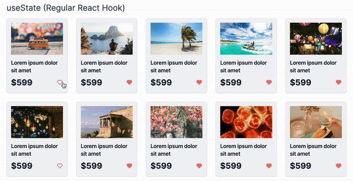
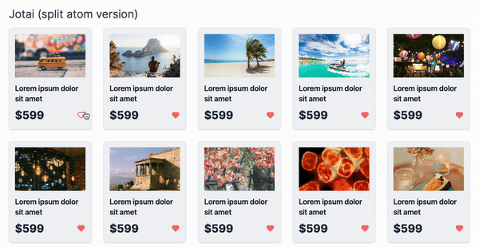

This is a [Next.js](https://nextjs.org/) project bootstrapped with [`create-next-app`](https://github.com/vercel/next.js/tree/canary/packages/create-next-app).

## Getting Started

First, run the development server:

```bash
npm run dev
# or
yarn dev
# or
pnpm dev
# or
bun dev
```

Open [http://localhost:3000](http://localhost:3000) with your browser to see the result.

## **Application Overview: Cards with Interactivity**

Our practical example involves a list of cards, each featuring a "like" button for user interaction. Initially managed with **`useState`**, we'll showcase the performance gains achieved by implementing **`splitAtom`** in larger applications.

### React's useState Setup

<p align="center">
        
</p>

### Addressing Unnecessary Re-renders with splitAtom

<p align="center">
        
</p>
